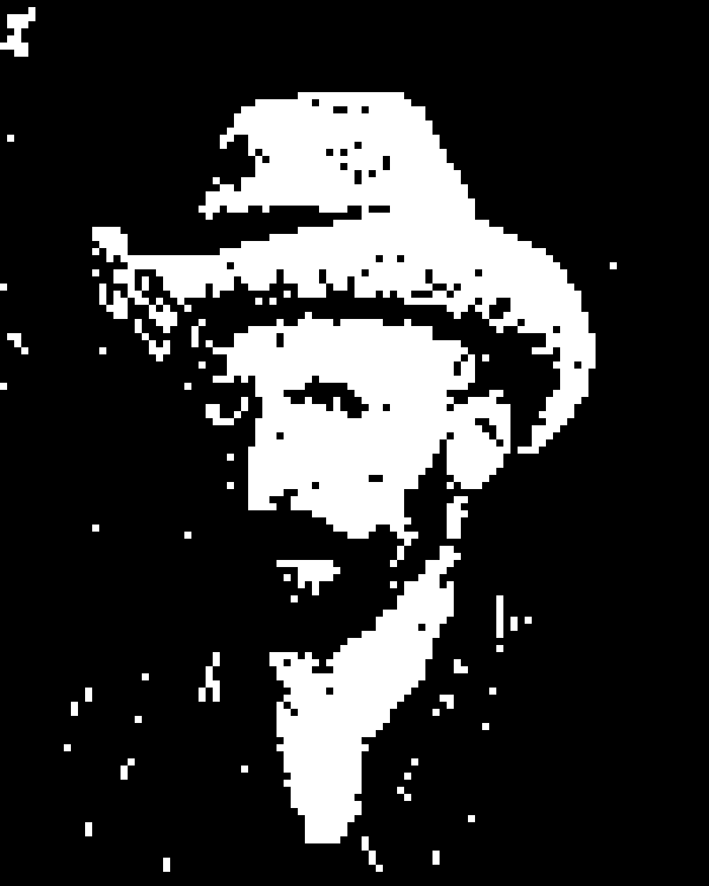
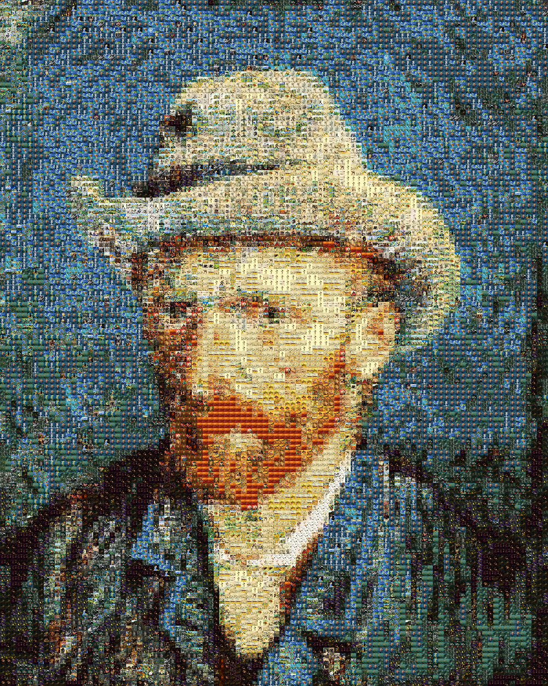

# 《梵谷六重奏》Photomosaic

> 資料量與視覺還原度的實驗

以梵谷自畫像為主圖，使用六種不同規模的圖庫進行 Photomosaic 重構，
探索「資料量如何影響視覺化品質」。

---

## 實驗設計：六種資料庫規模

| 實驗 | 資料庫 | 小圖數量 | 輸出 |
|------|--------|----------|------|
| 1 | 純色方塊（2 色） | 2 | `out2.png` |
| 2 | 純色方塊（7 色） | 7 | `pixel_7/` |
| 3 | 純色方塊（24 色） | 24 | `out24.png` |
| 4 | 梵谷單一畫家 | ~130 | `outvan.png` |
| 5 | 馬球衫圖片 | ~500 | `opolo.png` |
| 6 | 世界名畫全集 | 16,145 | `oart.png` |

---

## 技術架構

```
輸入圖片
   ↓
分割成 N×N 像素的小磁磚
   ↓
計算每個磁磚的平均色彩（KMeans Dominant Color）
   ↓
從圖庫中找最接近色彩的小圖（cache.json 加速查詢）
   ↓
拼合成最終 Photomosaic
   ↓（可選）
EDSR 超解析模型放大（x2 / x3 / x4）
```

---

## 檔案說明

```
Photomosaic/
├── index.html           # 成果展示網頁（GitHub Pages）
├── src/
│   ├── main.py          # 主要 Photomosaic 生成器
│   ├── test.py          # 改進版（更細磁磚、更好的錯誤處理）
│   ├── dominant.py      # KMeans 色彩分析工具
│   └── cache.json       # 圖庫色彩快取（加速查詢）
├── videos/              # 六種實驗的成果影片
├── tiles/
│   ├── pixel_2/         # 2 色純色方塊磁磚
│   ├── pixel_7/         # 7 色純色方塊磁磚
│   └── pixel_24/        # 24 色純色方塊磁磚
├── data/
│   ├── Van Gogh.png     # 原始目標圖片
│   ├── out2.png         # 實驗 1 輸出（2 色）
│   ├── outvan.png       # 實驗 4 輸出（梵谷圖庫）
│   └── oart.png         # 實驗 6 輸出（世界名畫 16,145 張）
└── van/                 # 梵谷單一畫家圖庫（磁磚來源）
```

> 圖庫資料集（`art/`，2.1 GB）與 AI 模型（`EDSR_*.pb`）因檔案過大未上傳。

---

## 環境需求

```bash
pip install opencv-python numpy scikit-learn
```

---

## 使用方式

```bash
# 基本生成
python main.py

# 改進版（更細緻）
python test.py

# 分析圖片的主色調
python dominant.py
```

---

## 成果展示

| 原圖 | 2 色像素 | 梵谷圖庫 | 世界名畫（16,145 張） |
|:---:|:---:|:---:|:---:|
|  |  |  |  |

> 🎬 完整六種實驗影片：[展示網頁](https://doreen1113.github.io/Photomosaic/)

---

## 參考來源

- 原始 Photomosaic 模板：[Python-Photomosaic](https://github.com/codebox/mosaic)
- EDSR 超解析模型：[OpenCV DNN Super Resolution](https://docs.opencv.org/4.x/d5/d29/tutorial_dnn_superres_upscale_image_single.html)
- 圖庫來源：WikiArt（49 位畫家，16,145 幅名畫）
